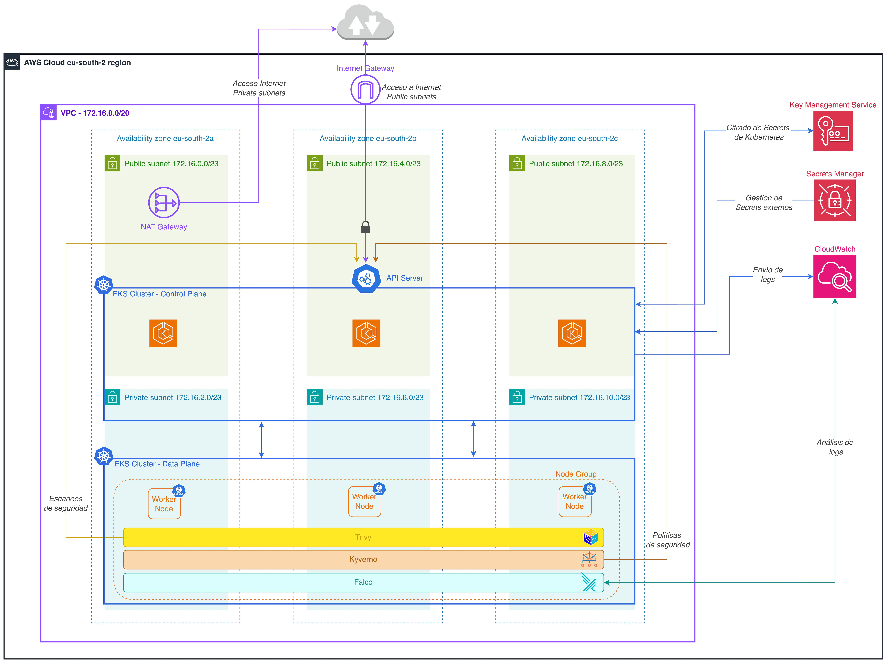

<p align="center">
  
</p>

## Trabajo Final de Máster en Ciberseguridad y Privacidad
##  Diseño e implementación de un clúster Kubernetes seguro en AWS
### Autor: Ángel Saldaña López

### Índice
1. [Introducción](#introducción)
2. [Arquitectura](#arquitectura)
3. [Despliegue](#despliegue)
   1. [Requisitos](#requisitos)
   2. [Instrucciones](#instrucciones)

### Introducción
Kubernetes juega un rol fundamental en los procesos actuales de desarrollo de software al ser una plataforma que reúne 
todas las funcionalidades necesarias para gestionar la operativa de una aplicación basada en microservicios. 
A pesar de sus ventajas, lo cierto es que muchas organizaciones descartan o ralentizan su adopción debido a los 
problemas de seguridad que acechan a esta tecnología. 

En este trabajo se han analizado los principales riesgos que afectan a Kubernetes según el modelo de amenazas 
_“OWASP Kubernetes Top Ten”_. A partir de esta referencia, se ha diseñado e implementado un clúster EKS seguro en 
Amazon Web Services con el objetivo de mitigar las amenazas identificadas. Aplicando la guía de buenas prácticas de 
fortificación de sistemas del proveedor cloud, se ha creado la infraestructura con código Terraform. 
Después, se han definido políticas de seguridad con Kyverno para garantizar el cumplimiento de las directivas 
establecidas en las cargas de trabajo. Finalmente, se ha instalado Falco para monitorizar los logs y alertar en 
tiempo real de eventos sospechosos y se han configurado escaneos de seguridad periódicos con Trivy para obtener 
informes de vulnerabilidades. Las acciones implementadas integran la seguridad en los ciclos de desarrollo de software 
siguiendo las metodologías DevSecOps, obteniendo como resultado un producto exportable al ámbito empresarial.

### Arquitectura
La arquitectura que se ha diseñado para este TFM se puede ver en el diagrama siguiente:



### Despliegue

#### Requisitos
Para poder desplegar la arquitectura anterior se debe cumplir con los siguientes requisitos:
- Cuenta de AWS con permisos para crear recursos en los servicios EKS, EC2, CloudWatch, VPC, AWS Secrets Manager e IAM.
- Utilidad de línea de comandos `terraform >= 1.8.2`
- Utilidad de línea de comandos `aws`
- Utilidad de línea de comandos `kubectl`
- Utilidad de línea de comandos `helm`

#### Instrucciones
El código para crear la infraestructura se encuentra en el directorio [terraform](./terraform) donde,
el archivo [main.tf](./terraform/main.tf), contiene toda las configuraciones específicas para cumplir con el diseño anterior.

Para facilitar el proceso, se ha creado el script [install_all.sh](./install_all.sh) que se encarga de desplegar el clúster 
EKS en AWS e instalar posteriormente las aplicaciones Kyverno, Falco y Trivy. Los pasos a seguir para utilizar este script son:

1. Descargar este repositorio de GitHub localmente:
```bash
git clone https://github.com/asaldana-uoc/tfm-ciberseguridad.git
```
2. Definir la variable de entorno _AWS_ACCOUNT_ con el valor del identificador de la cuenta personal de AWS:
```bash
export AWS_ACCOUNT=123456789012
```
3. Ejecutar el shell script (dar permisos de ejecución con `chmod` si no los tuviera):
```bash
./install_all.sh
```


